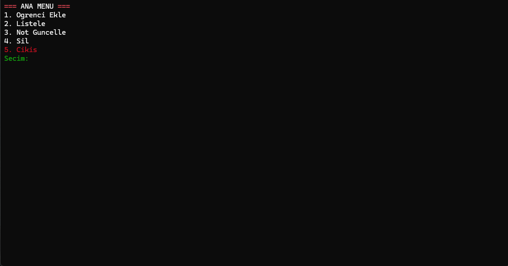

# 🎓 Öğrenci Yönetim Sistemi (Student Management System)


C++ ile geliştirilmiş, dosya tabanlı (File I/O) çalışan, özel renklendirilmiş terminal arayüzüne ve **gelişmiş ASCII Art logo tasarımına** sahip bir öğrenci otomasyon projesi.

## 📸 Ekran Görüntüleri



## ✨ Özellikler

Bu proje standart bir konsol uygulamasından fazlasını sunar:

* **🎨 Özel Arayüz Tasarımı:** Terminalde Kırmızı, Yeşil ve Beyaz renk kombinasyonları ile modern bir görünüm.
* **🆔 Benzersiz "MURAT" Logosu:** `windows.h` kütüphanesi kullanılarak oluşturulmuş, bozulmayan özel ASCII logo.
* **💾 Kalıcı Veri Yönetimi:** Tüm öğrenci verileri `ogrenciler.txt` dosyasında saklanır. Program kapansa bile veriler kaybolmaz.
* **🇹🇷 Türkçe Karakter Desteği:** UTF-8 entegrasyonu sayesinde Türkçe isimler ve menüler sorunsuz görüntülenir.
* **🛡️ Hata Yönetimi:** Yanlış veri girişlerini (örneğin nota harf girmek) engelleyen `try-catch` mekanizmaları.

## 🛠️ Fonksiyonlar (CRUD)

Proje aşağıdaki temel işlemleri gerçekleştirir:

1.  **Öğrenci Ekle (Create):** Öğrenci numarası (benzersizlik kontrolü ile), ad, soyad ve ortalama girişi.
2.  **Listele (Read):** Kayıtlı tüm öğrencileri hizalı bir tablo formatında listeleme.
3.  **Güncelle (Update):** Numarası girilen öğrencinin not ortalamasını güncelleme.
4.  **Sil (Delete):** Kayıtlı bir öğrenciyi sistemden ve dosyadan kalıcı olarak silme.

## 🚀 Kurulum ve Çalıştırma

Projeyi bilgisayarınızda çalıştırmak için adımları izleyin:

1.  **Projeyi Klonlayın:**
    ```bash
    git clone https://github.com/Omer-Murat/Ogrenci-Yonetim-Sistemi.git
    ```
2.  **Visual Studio ile Açın:**
    `Öğrenci Kayıt Sistemi.slnx` (veya `.sln`) dosyasına çift tıklayın.
3.  **Çalıştırın:**
    Visual Studio üst menüsünden `Local Windows Debugger` butonuna basın veya **CTRL + F5** yapın.

> **Not:** Program ilk açıldığında `ogrenciler.txt` dosyasını otomatik olarak oluşturacaktır.

## 💻 Kullanılan Teknolojiler

* **Dil:** C++ (Standart Template Library - STL)
* **Veri Yapıları:** `struct`, `vector`
* **Dosya İşlemleri:** `fstream` (Okuma/Yazma)
* **Kütüphaneler:** `<iostream>`, `<vector>`, `<string>`, `<windows.h>`, `<iomanip>`

Geliştirici Ömer Murat

---
*Bu proje eğitim amaçlı geliştirilmiştir ve açık kaynak kodludur.*
